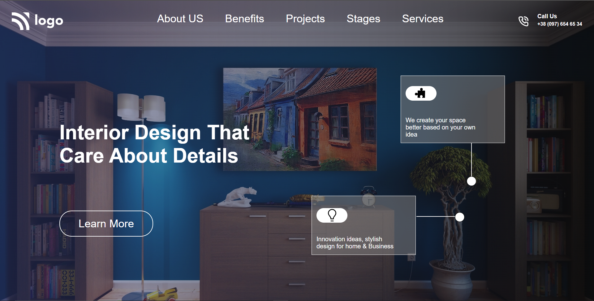

# Interior Designing Landing Page

We have this beautifully designed Web-page which shows how a Interior Designer would exactly see, how they design a home. 


## Technical Stack used - 

- ```HTML 5``` 
- ```CSS 3```

We have used a picture of a living room as a background and textured it with using   ```linear-gradient``` , a CSS property, so that it gives a subtle look to our website. 

## The mostly used CSS properties for designing this project are - 

- ``` CSS : Selectors ```
- ``` CSS : Positions ```
- ``` Display : flex; ```


## The landing page looks like - 

